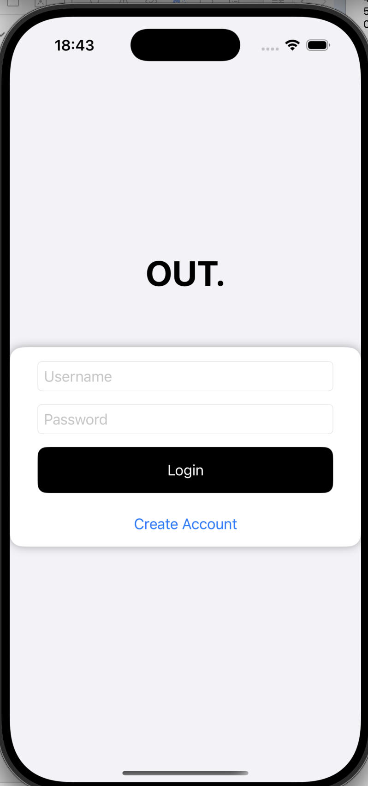
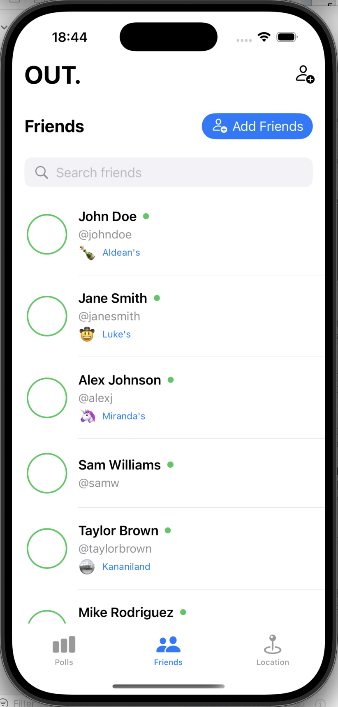

# What's the Move (OUT App)

An iOS application designed to enhance location safety and strengthen interconnectivity among college students through an innovative location tracking and polling system.

## Overview

"What's the Move" (OUT App) acts as an integrated social network, allowing college students to connect with friends and plan their nights out efficiently and safely. The application utilises real-time location updates, proximity tracking, and interactive polling to create a seamless experience for users, prioritising both coordination and safety.

## Key Features

### User Authentication

The application features a secure, university-exclusive authentication system that ensures all users are verified students, creating a trusted environment for socialisation and planning.

### Interactive Venue Polling

*Users can vote on venues and see real-time updates of where friends are planning to go*

*Interactive poll results show which venues are most popular among friends*

Each morning, users receive an interactive poll asking, "What's the move for tonight?" allowing them to indicate their plans for events or venues. This feature enables:
- Democratic decision-making within friend groups
- Real-time aggregation of votes
- Friend-specific voting statistics
- Comment system for discussing venue choices

### Real-time Location Tracking

*Live map showing friends' locations and nearby venues*

The application leverages CoreLocation and MapKit to provide precise, real-time location tracking within friend groups:
- Live updates showing friends' current locations
- Proximity notifications when friends approach, enter, or leave venues
- Privacy controls allowing users to manage location sharing permissions
- Battery-efficient implementation with intelligent update intervals

### Friend Management System

*Manage your friends and create groups for specific events*

*Stay updated with where your friends are going*

Users can create temporary "friend groups" for specific nights out:
- Add friends from within the university network
- Real-time status updates of friends' activities
- In-app communication for coordinating plans
- Safety features for monitoring group members' whereabouts

## Technical Implementation

### Frontend Architecture
The application is built using Swift and SwiftUI, featuring:
- Clean, intuitive user interface with modern design principles
- Responsive layouts adapting to various iOS devices
- Custom animations and transitions for enhanced user experience
- Comprehensive error handling with informative user feedback

### Backend Integration
The backend system utilises:
- RESTful API architecture for client-server communication
- Secure authentication with JWT token implementation
- Real-time database updates for polling and location services
- Efficient data caching to minimize network usage

### Location Services
The sophisticated location system implements:
- Optimised CoreLocation integration for battery efficiency
- Geofencing capabilities for venue-based notifications
- Intelligent throttling of location updates
- Privacy-focused design with user-controlled permissions

## Development Process

The application was developed using an agile methodology with weekly sprints, incorporating:
- Comprehensive user research and competitive analysis
- Iterative design process with continuous user feedback
- Extensive testing for reliability and performance

## Future Enhancements

Planned future developments include:
- Predictive analytics for venue popularity
- Enhanced safety features with automatic check-ins
- Integration with venue booking systems
- Cross-platform availability

---
